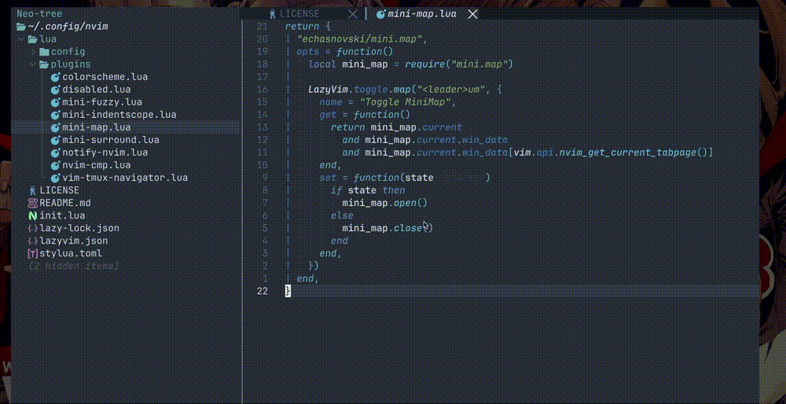

<!--toc:start-->
- [Demo](#demo)
- [Prerequisites](#prerequisites)
- [Installation](#installation)
  - [Backup current configuration](#backup-current-configuration)
  - [Clone repository and copy to current file](#clone-repository-and-copy-to-current-file)
<!--toc:end-->

## Demo




## Prerequisites

Before you begin, ensure you have the following tools installed:

- brew installed all following plugins:
  - zsh
  - fzf
  - eza
  - zsh-autosuggestions
  - zsh-syntax-highlighting
  - zoxide
  - nvim
  - tmux
- Install [Oh-my-zsh](https://ohmyz.sh/#install)
- Install Python, and using pip to install groq (optional)
  - `pip install groq`

## Installation

### Backup current configuration

Before applying new configurations, it's important to back up your existing ones:

```bash
mv ~/.config/zsh/ ~/.config/zsh.bak/
mv ~/.config/wezterm ~/.config/wezterm.bak/
mv ~/.config/nvim ~/.config/nvim.bak/
mv ~/.zshrc ~/.zshrc.bak
```

This will move your current configurations to backup folders, so you can restore them if needed.

### Clone repository and copy to current file

Next, clone the repository containing your terminal configuration and copy the necessary files:

```bash
git clone https://github.com/ThanhTanPM2000/my-terminal-configuration.git 
```

Once cloned, copy the relevant files from the repository to your current configuration directories:

```bash
cd my-terminal-configuration && \
cp -r .config/nvim/ ~/.config/ && \
cp -r .config/zsh/ ~/.config/ && \
cp -r .config/wezterm/ ~/.config/ && \
cp .zshrc ~/.zshrc && \
cp .tmux.conf ~/.tmux.conf
```

- .config/nvim/: Copies your Neovim configuration.
- .config/zsh/: Copies Zsh-related configurations.
- .config/wezterm/: Copies configurations for WezTerm (a terminal emulator).
- .zshrc: Replaces your Zsh configuration file.
- .tmux.conf: Replaces your Tmux configuration file.

## Push current configuration to repository (for owner of repo)

Clone the `github` repository to our local system

```bash
git clone https://github.com/ThanhTanPM2000/my-terminal-configuration.git && cd my-terminal-configuration
```

Copy the local configuration to repository

```bash
rm -rf .config && \
cp -r ~/.config . && \
cp ~/.zshrc . && \
cp ~/.tmux.conf .
```
